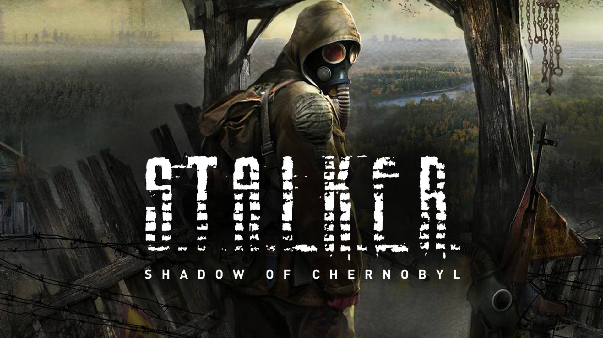

<p align="center"><i>S.T.A.L.K.E.R.: Shadow of Chernobyl tells a story about survival in the Zone – a very dangerous place, where you fear not only the radiation, anomalies and deadly creatures, but other S.T.A.L.K.E.R.s, who have their own goals and wishes.</i>
</p>


**Download: [stalker-appimage](https://github.com/linux-ott/stalker-appimage/releases/tag/stalker-appimage)**

No wine installation required

## Dependencies

### Arch
```
sudo pacman -S wget jq curl
```

### Debian/Ubuntu/elementaryOS
```
sudo apt install wget jq curl
```

## Install Stalker

Do not change the folder-paths on Windows

Install via Winetricks ```directplay```

```
git clone https://github.com/linux-ott/stalker-appimage.git
cd stalker-appimage/
./stalker-appimage.sh --install /path/to/stalker/gog.exe
./stalker-appimage.sh --winetricks
```

Installation directory ```$HOME/.local/apps/stalker```

## Usage Arguments

| Arguments                              |    | What its does                                   |
|----------------------------------------|----|-------------------------------------------------|
| --install /path/to/stalker/gog.exe     | => | Installed Stalker                               |
| --run                                  | => | Run Stalker                                     |
| --remove                               | => | Removed Stalker                                 |
| --winetricks                           | => | Start Winetricks                                |


## Sources

**[Wine32-AppImage](https://github.com/sudo-give-me-coffee/wine32-deploy)**

**[German Patch](https://www.compiware-forum.de/downloads/file/191-s-t-a-l-k-e-r-shadow-of-chernobyl-german-patch/#versions)**
